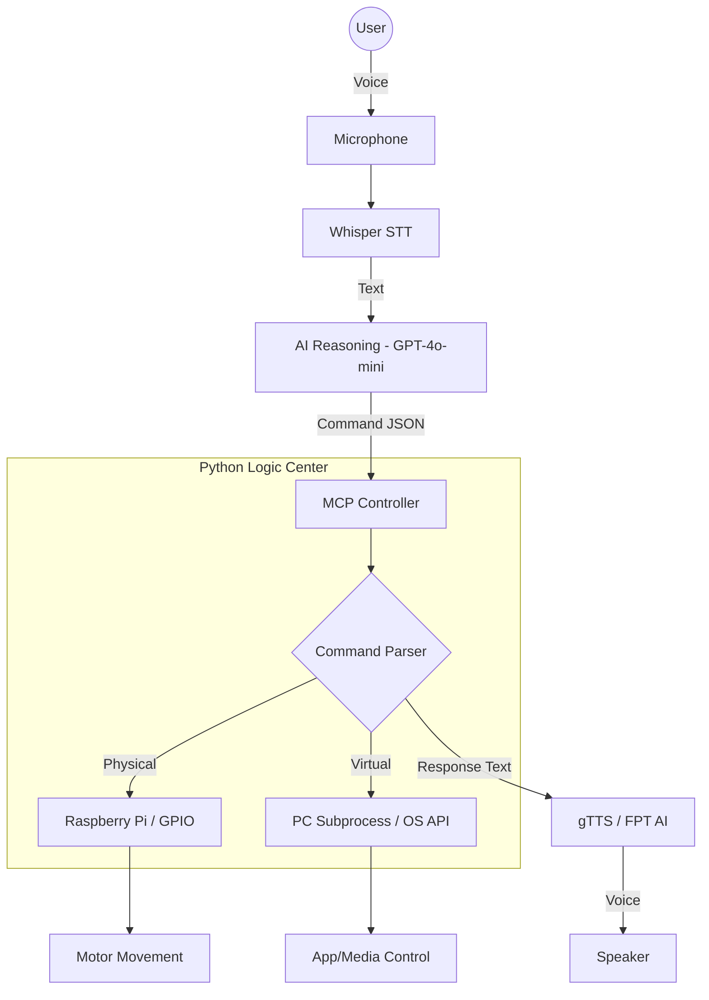

# Voice-Controlled AI Robot & PC Assistant 🤖🎙️

A multi-modal AI assistant system that integrates computer vision, speech recognition, and large language models (LLMs) to control physical robots and personal computers through natural language.

---

## 🎯 Project Objectives

Building an AI system capable of:
- **Speech Interaction**: Recognizing voice commands in both Vietnamese and English.
- **Intent Understanding**: Leveraging GPT-4o-mini to interpret complex user intentions.
- **Physical Robotics**: Controlling robot movements (forward, backward, turn, stop) via Raspberry Pi.
- **PC Automation**: Executing system commands (open apps, play music, volume control).
- **Audio Feedback**: Responding to users via high-quality Text-to-Speech.

---

## 🧠 System Architecture

The system follows a layered architecture combining **MVC (Model-View-Controller)** principles with the **MCP (Model Context Protocol)** for secure and scalable AI-to-Hardware communication.



---

## 🧩 Technology Stack

| Component | Technology |
|---|---|
| **Programming Language** | Python 3.x |
| **Hardware** | Raspberry Pi 4/5 (Robot), Desktop/Laptop (Assistant) |
| **Speech-to-Text (STT)** | OpenAI Whisper |
| **AI Reasoning** | GPT-4o-mini |
| **Text-to-Speech (TTS)** | gTTS / FPT AI |
| **Hardware Interface** | RPi.GPIO (Motor Drivers) |
| **PC Control** | `subprocess`, `pyautogui`, `os` |
| **Communication** | MCP (Model Context Protocol) |

---

## 📄 Command Schema (JSON)

The AI model remains "sandboxed" and only outputs structured JSON, which is then validated and executed by the Python Controller.

```json
{
  "intent": "move_robot",
  "action": "forward",
  "duration": 2,
  "app": null,
  "song": null,
  "speech": "I am moving forward for 2 seconds"
}
```

---

## 🔐 Safety & Security

- **Sandboxed Execution**: The AI does not have direct shell access.
- **Whitelisting**: Only pre-approved applications can be opened on the PC.
- **Hardware Safeguards**: Robot commands include mandatory duration/speed limits and "emergency stop" triggers.
- **Validation**: All JSON commands are parsed and validated against strictly defined schemas.

---

## 🚀 Future Roadmap

- [ ] ROS2 Integration for advanced SLAM and Navigation.
- [ ] Computer Vision (OpenCV) for face/object tracking.
- [ ] Low-latency Edge TTS for faster response times.
- [ ] Mobile App dashboard for remote monitoring.
# ps-ai-assisant
# ps-ai-assisant
